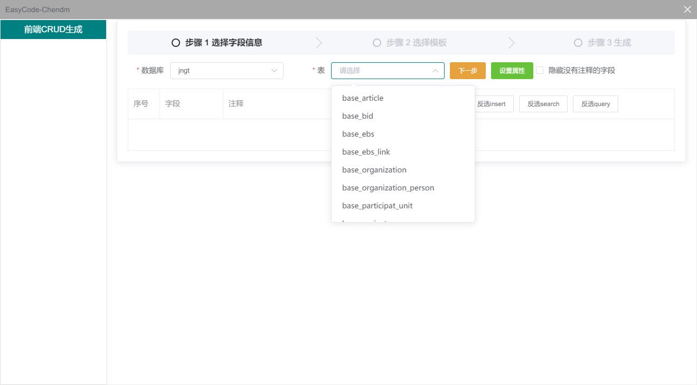

# 前端代码生成器使用说明

- 连接数据库
    点击标题，选择`连接数据库`
  
    

    输入相关信息， 点击确定， 点击`前端CRUD生成`
  
    

- 选择数据库
  
    

- 选择表
  
    
  
    会自动出现表字段

- 信息说明
  
    
  
    insert复选框代表新增时需要展示的字段
    search复选框代表搜索时需要的字段
    query复选框代表table需要展示的字段
    上移和下移可以移动字段，新增和table的字段展示顺序和`序号`相关
  
- 设置属性
    `设置属性`需要设置一些模板需要的属性，下面就以`bim`模板为例
    ```
        t: "新增项目" ( 新增按钮的文字 )
        r: "必填字段序号 用英文逗号隔开" 
        kp: "主键字段"
        name: "当前页面名称",
        api: "api前缀 例如/pm/baseproject/"
    ```
    以上参数都是必填， 如图所示
  
    
  
- 选择Ejs模板
  
    
  
- 生成
  
    文件名: 生成的文件名
  
    其他地方和图片中一致即可
  
    
  
- 模板存放位置
  
  `c:\用户名\appData\Local\Programs\easycode-javascript\resources\static\ejs`
    
- Ejs模板学习

    
  
